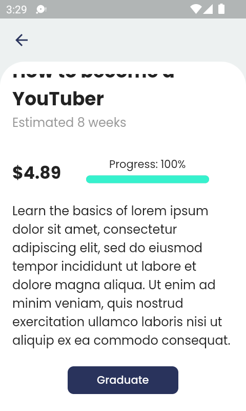
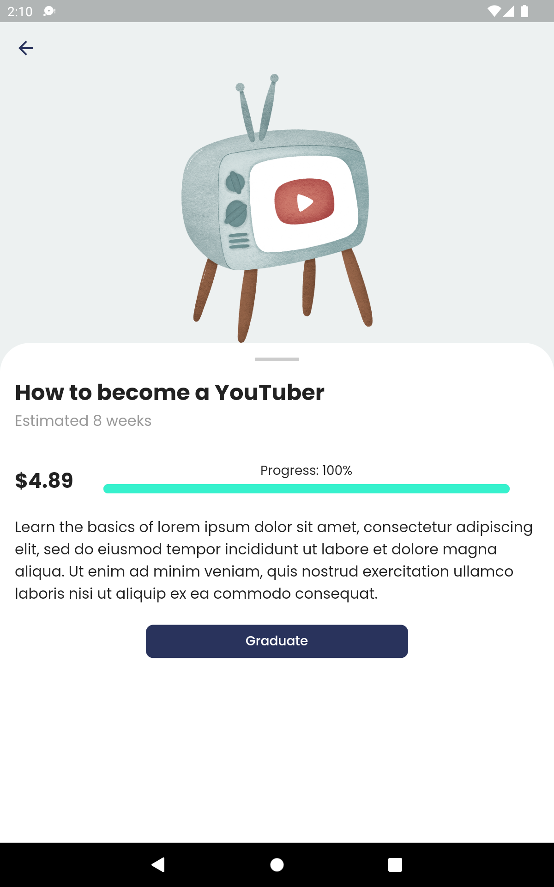

# online_courses_ui

This app is my submission for Flutter UI Contest 1.0 by Flutter Guide

### Demo

#### Normal screen (Pixel 2)
   

 

#### Small screen (Nexus S)
    

 

#### Tablet (Nexus 7)
   

### Credits

- Design inspired by Sergey Martyn's work: https://dribbble.com/shots/17155875-Medicine-Delivery-App-Design-Concept
- Illustrations by <a href="https://icons8.com/illustrations/author/60ed83d88abd3c77b41f4194">Olga Filatova</a> from <a href="https://icons8.com/illustrations">Ouch!</a>
